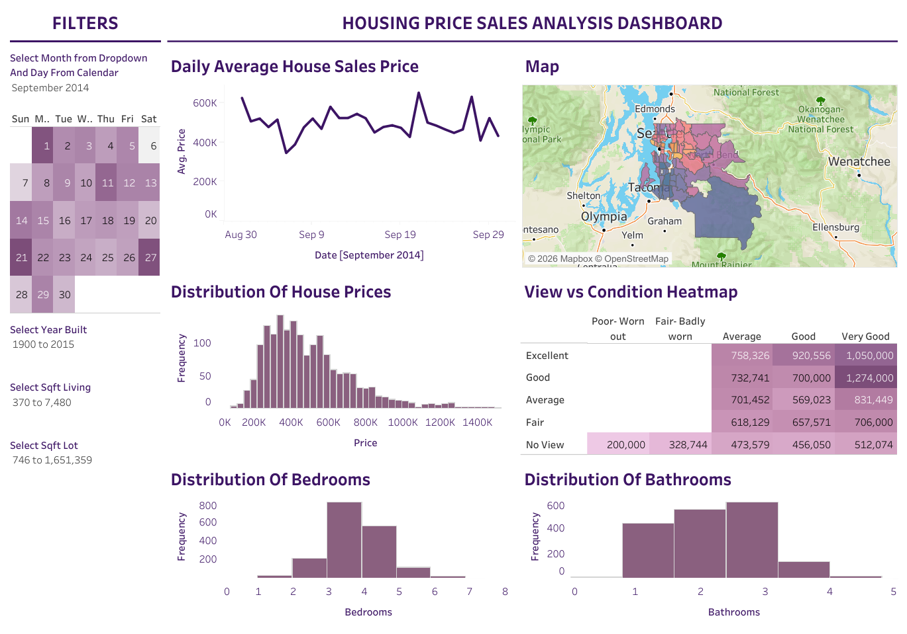
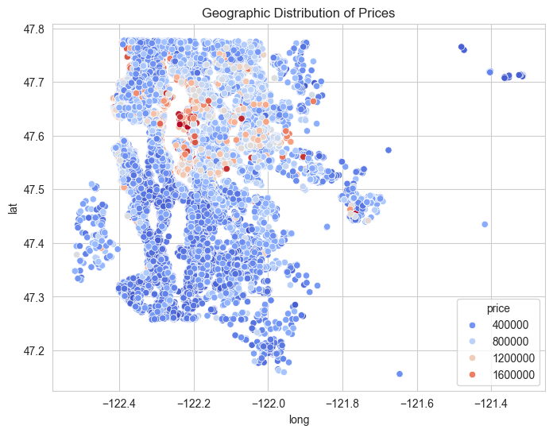
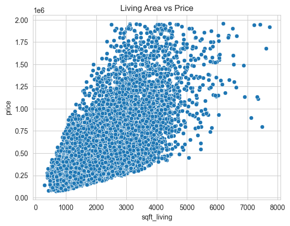
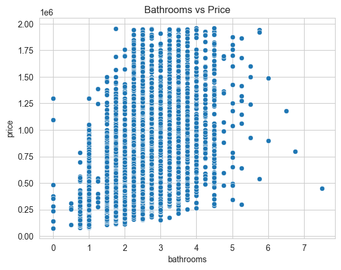
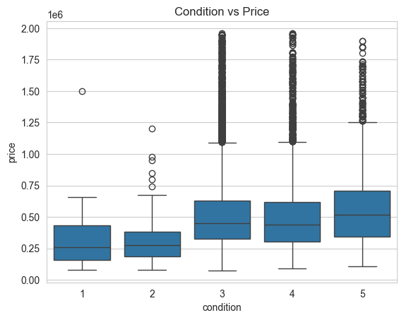
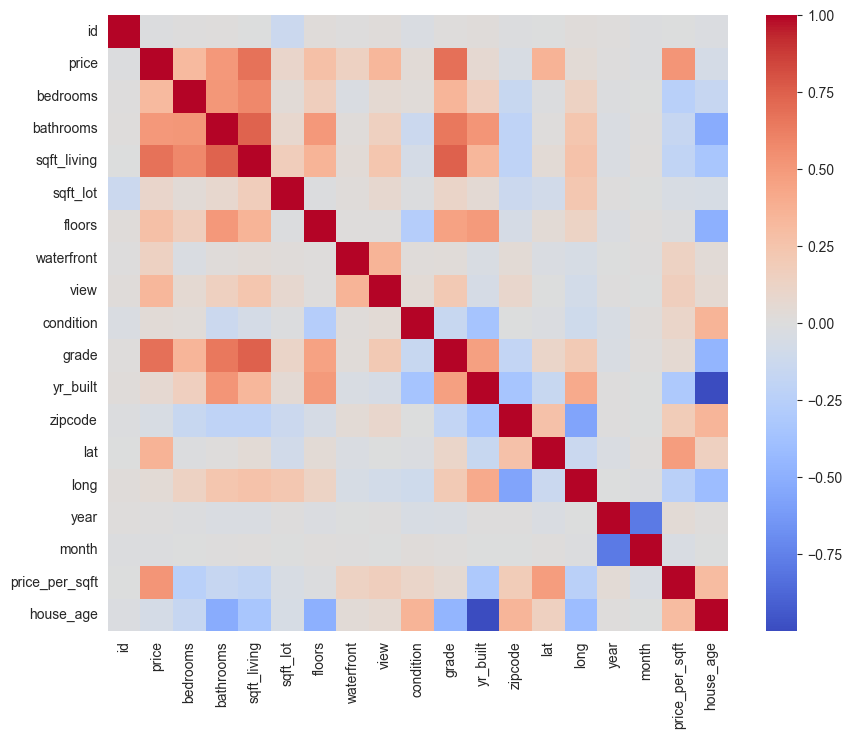

# King County Housing Market Analysis

## Purpose

This project is a hands‑on exploration of how property attributes and location influence sale prices in King County. The goal is to build a repeatable analysis workflow, extract decision‑ready insights, and document each step so the logic is easy to follow and extend.

## Highlights

* Clean, modular data preparation utilities in [src/](src/)
* Notebook‑driven EDA with clear commentary and visual evidence
* Location‑aware insights using latitude/longitude and zipcode groupings
* Tableau dashboard assets for storytelling and stakeholder‑ready sharing

## Repository Layout

```text
Housing-Market-Pricing-Analysis-EDA/
├── data/                               # Raw dataset
│   └── kc_house_data.csv
├── analysis_images/                    # Exported charts from the notebook
├── src/                                # Reusable analysis helpers
│   ├── __init__.py
│   ├── config.py
│   └── data_prep.py
├── tableau/                            # Tableau workbook + exports
├── housing_analysis.ipynb              # Main EDA notebook
├── requirements.txt
└── README.md
```

## Quick Start

1) Create and activate a virtual environment
2) Install dependencies from [requirements.txt](requirements.txt)
3) Open [housing_analysis.ipynb](housing_analysis.ipynb) and run cells in order

## Notebook Workflow

1. **Load + basic profiling**
  * Schema checks, summary statistics, missing value scan
2. **Feature engineering**
  * Date parts, `price_per_sqft`, `house_age`, price tiers
3. **Price drivers**
  * Relationships with size, bathrooms, grade, view, and waterfront
4. **Geographic signals**
  * Zipcode premiums and spatial price clusters
5. **Market timing**
  * Monthly price trends and seasonal effects

## Key Findings (Current)

* Living area is the strongest single driver of price.
* Construction quality (`grade`) consistently outperforms `condition`.
* Waterfront and high‑view homes command clear premiums.
* Location effects are strong: some zipcodes show markedly higher $/sqft.

## Tableau Assets

Dashboard preview: 

## How to Extend This Project

If you want to expand the analysis, consider:

* A modeling notebook with baseline regressions and error metrics
* Data quality checks with a structured report output
* Segment profiles (budget vs mid vs premium) with comparative visuals
* Automated chart export and a short executive summary

## Notes

The analysis is intentionally structured so you can evolve it: add new data sources, test hypotheses, and validate results without rewriting the core workflow.
### Price by Location


---
---
### Price vs Living Area


---
---
### Price vs Bathrooms


---
---
### Price vs Condition


---
---
### Correlation Analysis Heatmap


---

---
## Key Insights

* **Living area (sqft) is one of the strongest predictors of price**
  Larger homes consistently command higher prices, though with diminishing returns at extreme values.

* **Property grade and condition significantly impact pricing**
  Higher-grade homes show a clear upward shift in price distribution.

* **Waterfront and view properties carry a substantial premium**
  These features create distinct clusters of higher-priced homes.

* **Bedrooms alone are not a strong predictor of price**
  Properties with similar bedroom counts can vary widely in price depending on size and quality.

* **Outliers exist in both directions**
  Some properties are priced significantly higher or lower than expected, indicating unique characteristics or potential data irregularities.

---

## Visualization Highlights

The project includes:

- Price distribution histogram
- Scatter plots (price vs sqft, bathrooms, age)
- Boxplots (bedrooms, grade, condition, waterfront)
- Geographic scatter plot (lat vs long with price)
- Zipcode-wise bar charts
- Correlation heatmap
- Monthly trend line chart

---

## Tools and Technologies

* Python
* Jupyter Notebook
* Pandas
* Numpy
* Matplotlib / Seaborn

---


---

## Key Takeaways

* Housing prices are driven by a combination of **size, quality, and premium features**, rather than any single variable.
* Simple metrics (like bedroom count) are often misleading without context.
* Visualization is essential for uncovering patterns that are not obvious from raw data.
* A structured approach to data analysis leads to clearer and more reliable insights.

---# Housing-Market-Pricing-Analysis
# House-market-prediction
